# 🤖 AI Mail Redirection Agent

[](https://www.python.org/downloads/)
[](https://opensource.org/licenses/MIT)
[](#ai-integration)

An intelligent email routing system that uses AI (Ollama/Gemini) to automatically classify and redirect emails to appropriate department mailboxes.


## 🎯 Features

- **AI-Powered Classification** - Uses LLMs (Ollama or Google Gemini) to analyze email content
- **Automatic Routing** - Routes emails to department mailboxes (support, sales, HR, etc.)
- **Real-Time Dashboard** - Web interface with live email processing status
- **Configurable Rules** - YAML-based routing configuration
- **Multi-Provider AI** - Supports Ollama (local) and Gemini (cloud)
- **Complete Mail Server** - Includes Maddy mail server setup

## 🏗️ Architecture

```mermaid
graph TB
    subgraph "Email Flow"
        A[📧 Incoming Email] --> B[IMAP Client]
        B --> C[Email Parser]
        C --> D{AI Analyzer}
        D -->|Ollama| E[Local LLM]
        D -->|Gemini| F[Google API]
        E --> G[Classification]
        F --> G
        G --> H[Routing Engine]
        H --> I[SMTP Client]
        I --> J[📬 Department Mailbox]
    end
    
    subgraph "Web Dashboard"
        K[Flask Server] --> L[Real-time Updates]
        L --> M[SocketIO]
        M --> N[Browser UI]
    end
    
    H -.-> K
```



## 📦 Project Structure

```
mail-agent/
├── mail_agent/              # Core package
│   ├── analyzer/            # AI classification (Ollama/Gemini)
│   ├── client/              # IMAP/SMTP clients
│   ├── config/              # Configuration loading
│   └── router/              # Email routing engine
├── web_dashboard.py         # Flask web interface
├── email_logger.py          # Processing logs
├── setup.sh                 # Automated installation
├── control.sh               # Interactive control panel
├── config.yaml              # Routing rules
└── testserver/              # Maddy mail server config
```

## 🚀 Quick Start

### Prerequisites
- Linux (Ubuntu/Debian)
- Python 3.10+
- Ollama server OR Gemini API key

### Installation

```bash
# Clone the repository
git clone https://github.com/yourusername/ai-mail-agent.git
cd ai-mail-agent

# Run setup (installs Maddy mail server + Python deps)
sudo ./setup.sh

# Configure environment
cp .env.example .env
nano .env  # Add your AI provider settings

# Start the dashboard
./start.sh
```

### Access Dashboard
Open http://localhost:5000 in your browser.

## ⚙️ Configuration

### Environment Variables (.env)
```bash
# Email Server
IMAP_HOST=localhost
IMAP_PORT=143
SMTP_HOST=localhost
SMTP_PORT=587

# Email Account
EMAIL_ADDRESS=company@mail.local
EMAIL_PASSWORD=company01

# AI Provider (choose one)
OLLAMA_HOST=http://localhost:11434
OLLAMA_MODEL=qwen3:14b

# OR
GEMINI_API_KEY=your-api-key
```

### Routing Rules (config.yaml)
```yaml
categories:
  support:
    keywords: ["help", "issue", "problem", "bug"]
    target: support@mail.local
  sales:
    keywords: ["purchase", "pricing", "quote"]
    target: sales@mail.local
  hr:
    keywords: ["resume", "application", "hiring"]
    target: hr@mail.local
```

## 🧪 Python Features Demonstrated

### Advanced Concepts
- **Object-Oriented Programming** - Classes throughout (`IMAPClient`, `EmailRouter`, `AIAnalyzer`)
- **Type Hints** - Full typing support for better code quality
- **Context Managers** - IMAP connections using `with` statements
- **Decorators** - Flask routes, logging decorators
- **Module Organization** - Clean package structure with `__init__.py`
- **Async/Await** - Flask-SocketIO for real-time updates

### Standard Library Usage
- `imaplib` / `smtplib` - Email protocols
- `email` - Message parsing
- `pathlib` - Path handling
- `json` - Configuration and logging
- `dataclasses` - Data models

## 🤖 AI Integration (AI4SE)

This project demonstrates **AI for Software Engineering** by:

1. **LLM API Integration** - Connects to Ollama and Google Gemini
2. **Prompt Engineering** - Structured prompts for email classification
3. **JSON Response Parsing** - Extracts structured data from AI responses
4. **Fallback Handling** - Graceful degradation when AI is unavailable
5. **Confidence Scoring** - AI provides confidence levels for classifications

### Sample AI Prompt
```
Analyze this email and classify it:
Subject: {subject}
Body: {body}

Return JSON: {"category": "...", "confidence": 0.95, "reason": "..."}
```

## 📊 Dashboard Features

- **Live Email Processing** - Watch emails being classified in real-time
- **Statistics** - Processing counts, success rates
- **Log Viewer** - Detailed processing history
- **Manual Controls** - Start/stop watching, process single emails
- **System Status** - Mail server, AI provider connectivity

## 🧑‍💻 Development

### Running Tests
```bash
source .venv/bin/activate
pytest tests/ -v --cov=mail_agent
```

### Control Panel
```bash
./control.sh
# Press 'd' for debug mode (test options)
```

## 📄 License

MIT License - See [LICENSE](LICENSE) for details.

## 👨‍🎓 Academic Project

**Course:** SEN0414 Advanced Programming  
**University:** Istanbul Kültür University  
**Semester:** Fall 2025

---

*Built with ❤️ and Python*
