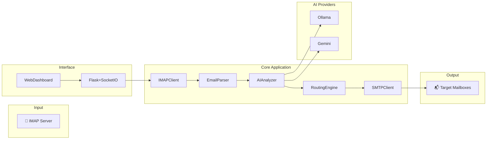
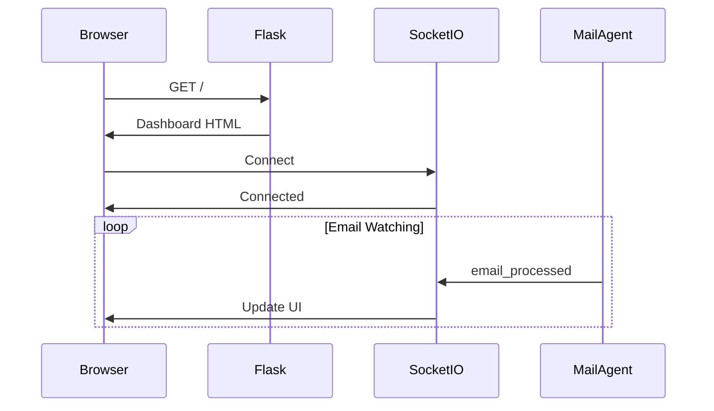
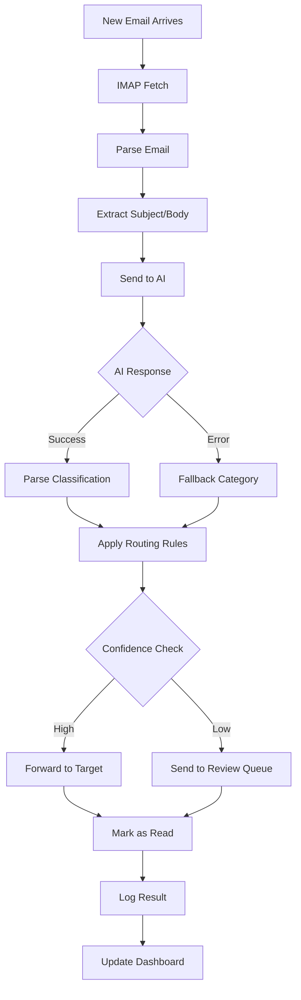

# Architecture Documentation

## System Overview

The AI Mail Redirection Agent is a modular Python application that automatically classifies and routes emails using AI-powered analysis.



## Component Details

### 1. Mail Agent Package (`mail_agent/`)

#### 1.1 Client Module (`client/`)
Handles all email protocol communications.

```python
# IMAPClient - Fetches unread emails
class IMAPClient:
    def __init__(self, host, port, address, password, use_ssl)
    def fetch_unread() -> Iterator[EmailMessage]
    def mark_as_read(uid: str)
    
# SMTPClient - Sends/forwards emails
class SMTPClient:
    def __init__(self, host, port, use_tls)
    def send(message: EmailMessage, to: str)
```

#### 1.2 Analyzer Module (`analyzer/`)
AI-powered email classification.

```python
# Base interface
class BaseAnalyzer(ABC):
    @abstractmethod
    def analyze(email: EmailMessage) -> AnalysisResult

# Implementations
class OllamaAnalyzer(BaseAnalyzer):
    """Uses local Ollama LLM"""
    
class GeminiAnalyzer(BaseAnalyzer):
    """Uses Google Gemini API"""
```

**AI Prompt Structure:**
```
You are an email classifier. Analyze this email and return JSON.

Subject: {subject}
From: {sender}
Body: {body}

Categories: support, sales, hr, legal, it, promotions, vendors

Return: {"category": "...", "confidence": 0.0-1.0, "reason": "..."}
```

#### 1.3 Router Module (`router/`)
Rule-based email routing with AI integration.

```python
class EmailRouter:
    def __init__(self, config: RouterConfig)
    def route(email: EmailMessage) -> RoutingDecision
    def execute(decision: RoutingDecision)
```

**Routing Logic:**
1. AI analyzes email content
2. Maps AI category to target mailbox
3. Applies confidence threshold
4. Falls back to "review" if uncertain

#### 1.4 Config Module (`config/`)
YAML-based configuration loading.

```python
@dataclass
class AppConfig:
    email: EmailConfig
    ai: AIConfig
    router: RouterConfig

def load_config() -> AppConfig
```

### 2. Web Dashboard (`web_dashboard.py`)

Flask application with real-time updates.



**Key Endpoints:**
- `GET /` - Main dashboard
- `GET /api/stats` - Processing statistics
- `GET /api/logs` - Email processing logs
- `WebSocket /` - Real-time updates

### 3. Email Logger (`email_logger.py`)

JSON Lines logging for email processing.

```json
{
  "timestamp": "2026-01-05T12:00:00",
  "message_id": "abc123",
  "subject": "Help with order",
  "from": "customer@example.com",
  "ai_category": "support",
  "ai_confidence": 0.95,
  "final_action": "forwarded",
  "target": "support@mail.local"
}
```

## Data Flow



## Configuration Schema

### config.yaml
```yaml
router:
  default_action: forward
  review_threshold: 0.7
  
categories:
  support:
    target: support@mail.local
    keywords: [help, issue, problem]
    
  sales:
    target: sales@mail.local
    keywords: [purchase, quote, pricing]
    
  hr:
    target: hr@mail.local
    keywords: [resume, application, job]
```

### .env
```bash
# Mail Server
IMAP_HOST=localhost
IMAP_PORT=143
SMTP_HOST=localhost
SMTP_PORT=587

# AI Provider
OLLAMA_HOST=http://localhost:11434
OLLAMA_MODEL=qwen3:14b
```

## Technology Stack

| Layer | Technology |
|-------|------------|
| Language | Python 3.10+ |
| Web Framework | Flask + Flask-SocketIO |
| Email Protocols | imaplib, smtplib |
| AI Providers | Ollama (local), Gemini (cloud) |
| Mail Server | Maddy |
| Configuration | YAML, dotenv |
| Logging | JSON Lines |

## Security Considerations

1. **Credentials** - Stored in `.env`, not in code
2. **TLS** - Supports STARTTLS for email connections
3. **Self-Signed Certs** - For local Maddy installation
4. **API Keys** - Gemini key kept secure

## Scalability

The current design supports:
- Single mailbox monitoring
- Sequential email processing
- Single AI provider at a time

Future improvements could add:
- Multiple mailbox monitoring
- Parallel processing
- AI provider fallback chain
